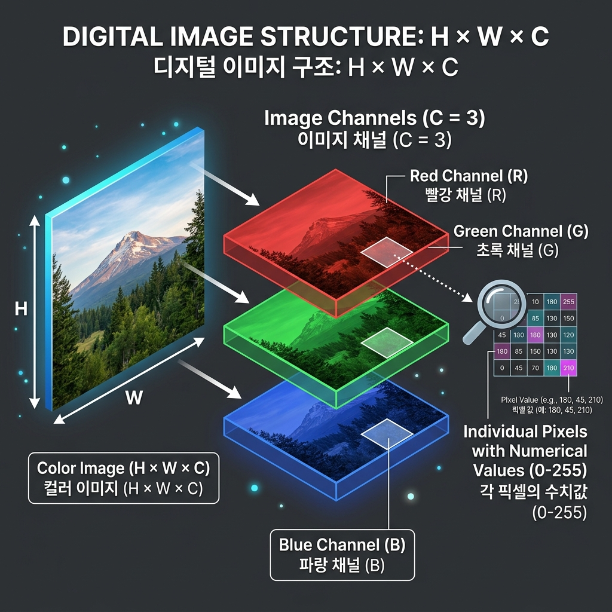
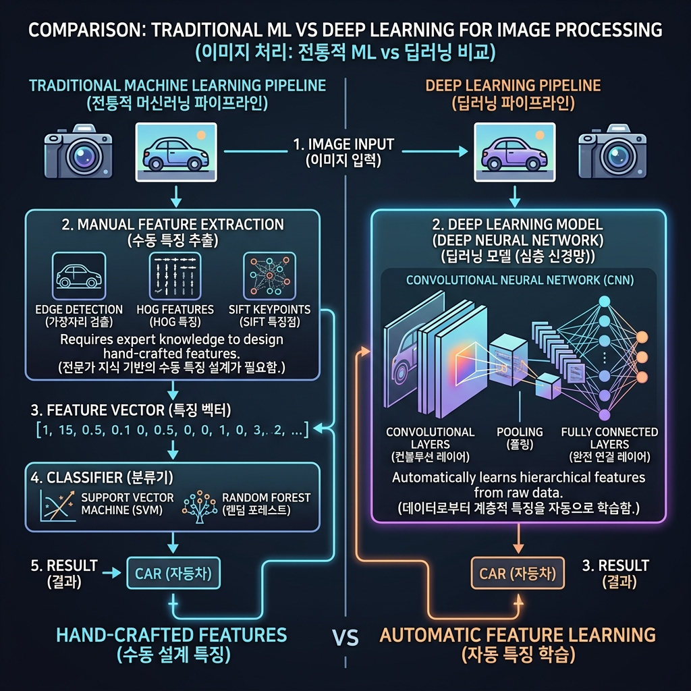
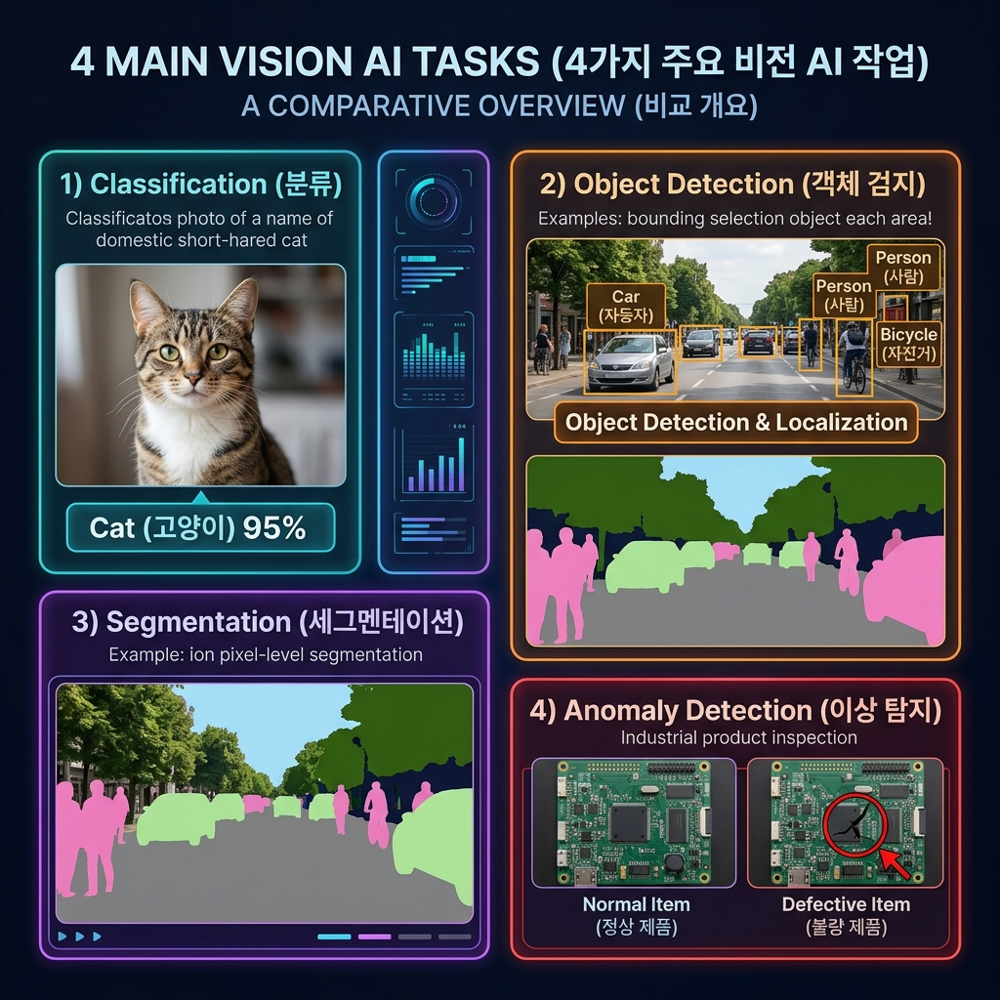
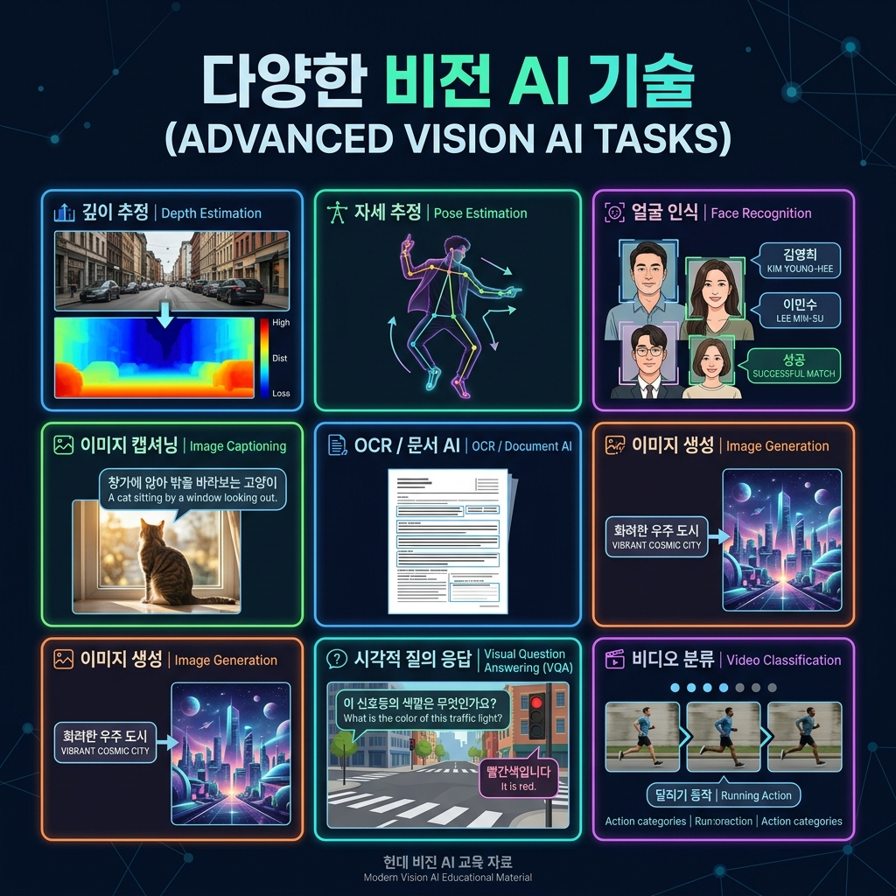

# 📘 Section 1. Vision AI 소개

> **학습 목표**
> - 이미지 데이터의 구조와 특성을 이해한다.
> - 이미지 데이터에 딥러닝이 효과적인 이유를 설명할 수 있다.
> - Vision AI의 주요 태스크(분류, 객체탐지, 분할, 이상탐지)를 구분할 수 있다.
> - Vision AI 기술의 다양한 응용 분야를 파악한다.

---

## 1-1. 이미지 데이터의 특징

### 🖼️ 이미지는 어떻게 구성되어 있을까?

우리가 보는 디지털 이미지는 컴퓨터에서 **숫자로 이루어진 3차원 배열(텐서)** 로 표현됩니다.



이미지는 **H × W × C** 의 3차원 구조를 갖습니다.

| 차원 | 의미 | 설명 |
|------|------|------|
| **H** (Height) | 높이 | 이미지의 세로 픽셀 수 |
| **W** (Width) | 너비 | 이미지의 가로 픽셀 수 |
| **C** (Channel) | 채널 | 색상 정보의 수 (예: RGB = 3채널) |

#### 📐 구체적인 예시

```
일반 컬러 사진 (Full HD):  1080 × 1920 × 3 = 6,220,800개의 숫자
스마트폰 카메라 (12MP):    3000 × 4000 × 3 = 36,000,000개의 숫자
MNIST 손글씨 이미지:         28 ×   28 × 1 = 784개의 숫자 (흑백)
```

- 각 픽셀은 **0~255** 사이의 정수 값을 가집니다 (8비트 기준).
- `0`은 가장 어두운 값(검정), `255`는 가장 밝은 값(흰색)입니다.
- 컬러 이미지는 **R(빨강), G(초록), B(파랑)** 3개 채널의 조합으로 모든 색을 표현합니다.

> 💡 **핵심 포인트**: 이미지의 **각 픽셀 값 하나하나가 모델이 다루는 하나의 특징(Feature)** 입니다.
> 따라서 이미지 데이터는 일반 정형 데이터(표 형태 데이터)에 비해 **특징의 수가 매우 많은 고차원 데이터**입니다.

---

### 🔗 이미지 데이터의 핵심 속성: 공간적 상관관계 (Spatial Correlation)

이미지 데이터에는 일반 정형 데이터와 구별되는 매우 중요한 특성이 있습니다.

**"인접한 픽셀들은 서로 비슷한 값을 가지며, 함께 의미 있는 패턴을 형성한다."**

```
예시: 고양이 사진의 일부 픽셀값

    [120, 122, 121, 119, 118]    ← 인접 픽셀끼리 값이 유사 (고양이 털 영역)
    [121, 123, 120, 118, 117]
    [119, 121, 122, 120, 119]
    [ 45,  42,  40,  38,  35]    ← 경계(Edge)에서 값이 급변 (털 → 배경)
    [ 30,  28,  25,  22,  20]    ← 배경 영역
```

이러한 **공간적 상관관계**의 의미는:
- **인접 픽셀 유사성**: 같은 물체에 속하는 인접 픽셀들은 비슷한 색상·밝기 값을 가짐
- **지역적 패턴 형성**: 픽셀들이 모여 엣지(Edge), 텍스처(Texture), 형태(Shape) 등의 패턴을 구성
- **계층적 구조**: 작은 패턴들이 모여 더 큰 의미 있는 구조를 형성 (엣지 → 윤곽 → 부위 → 객체)

---

### 🤖 왜 딥러닝이 이미지에서 강력할까?



#### 전통적인 머신러닝 (Traditional Machine Learning)

```
이미지 → [사람이 직접 특징 설계] → 특징 벡터 → 분류기(SVM 등) → 결과
           (HOG, SIFT, LBP 등)
```

- 사람이 **수작업으로 특징(Feature)을 설계**해야 함 (예: 윤곽선, 모서리, 텍스처 등)
- 설계한 특징이 문제에 적합하지 않으면 성능이 크게 떨어짐
- 수십만 개의 원시 픽셀 값을 직접 다루기에는 **차원의 저주(Curse of Dimensionality)** 문제 발생

#### 딥러닝 — CNN (Convolutional Neural Network)

```
이미지 → [CNN이 자동으로 특징 학습] → 결과
          (엣지 → 텍스처 → 부위 → 객체)
```

- **자동 특징 학습**: 모델이 학습 과정에서 어떤 특징이 중요한지 스스로 학습
- **공간적 구조 활용**: CNN의 **합성곱(Convolution) 연산**이 인접 픽셀 간의 관계(공간적 상관관계)를 자연스럽게 포착
- **계층적 특징 추출**: 하위 층에서는 단순한 패턴(엣지, 색상)을, 상위 층에서는 복잡한 패턴(얼굴, 물체)을 학습
- **파라미터 공유(Weight Sharing)**: 같은 필터를 이미지 전체에 적용하여 파라미터 수를 대폭 줄임

> 📌 **정리**: 이미지 데이터는 ① 매우 높은 차원(많은 픽셀)을 가지고, ② 픽셀 간 공간적 상관관계가 높다는 특성이 있습니다.
> CNN 기반 딥러닝은 이 두 가지 특성을 효과적으로 활용할 수 있도록 설계된 모델이기 때문에, 이미지 분야에서 전통적인 머신러닝보다 월등히 높은 성능을 보입니다.

---

## 1-2. Vision AI 주요 태스크 (Main Tasks)

Vision AI는 이미지·영상을 입력으로 받아 유의미한 정보를 추출하는 인공지능 기술의 총칭입니다. 다양한 태스크가 있지만, 가장 핵심이 되는 4가지 태스크를 먼저 살펴보겠습니다.



---

### 📋 (1) 이미지 분류 (Image Classification)

> **"이 이미지는 무엇인가?"**

| 항목 | 설명 |
|------|------|
| **정의** | 이미지 전체에 대해 **하나의 클래스(레이블)** 를 부여하는 태스크 |
| **입력** | 이미지 1장 |
| **출력** | 클래스 레이블 + 확률 (예: "고양이 95.2%") |

**활용 사례:**
- 🏥 의료 영상 진단: X-ray 사진을 정상/비정상으로 분류
- 🛒 제품 분류: 업로드된 상품 이미지를 카테고리별로 자동 분류
- 🌿 동식물 식별: 사진으로 꽃·곤충·새 등의 종을 판별

**대표 모델:** ResNet, VGG, EfficientNet, ViT (Vision Transformer)

```
💡 오늘 우리가 만들 MNIST 손글씨 인식 모델이 바로 "분류(Classification)" 태스크입니다!
   → 28×28 손글씨 이미지를 입력받아 0~9 중 하나의 숫자를 분류합니다.
```

---

### 🔍 (2) 객체 탐지 (Object Detection)

> **"이미지 안에 무엇이, 어디에 있는가?"**

| 항목 | 설명 |
|------|------|
| **정의** | 이미지 내 **여러 객체의 위치(Bounding Box)와 클래스**를 동시에 예측 |
| **입력** | 이미지 1장 |
| **출력** | 각 객체마다: 바운딩 박스 좌표 (x, y, w, h) + 클래스 + 확률 |

**활용 사례:**
- 🚗 자율주행: 도로 위 차량, 보행자, 신호등 실시간 탐지
- 📦 물류: 컨베이어 벨트 위 제품의 위치와 종류 파악
- 🔒 보안: CCTV 영상에서 특정 인물이나 물체 탐지

**대표 모델:** YOLO 시리즈, SSD, Faster R-CNN, DETR

**분류와의 차이점:**
```
분류(Classification):  이미지 1장 → "고양이" (전체 이미지에 대한 하나의 답)
객체탐지(Detection):   이미지 1장 → "고양이(여기), 강아지(저기), 사람(여기)" (여러 객체의 위치+클래스)
```

---

### 🎨 (3) 이미지 분할 (Image Segmentation)

> **"이미지의 모든 픽셀이 어디에 속하는가?"**

| 항목 | 설명 |
|------|------|
| **정의** | 이미지의 **모든 픽셀**에 클래스 레이블을 부여하여 영역을 나누는 태스크 |
| **입력** | 이미지 1장 |
| **출력** | 픽셀 단위의 마스크(Mask) 맵 |

**세부 유형:**

| 유형 | 설명 | 예시 |
|------|------|------|
| **Semantic Segmentation** (의미론적 분할) | 같은 클래스의 모든 픽셀을 동일하게 분류 | 도로=파랑, 차량=빨강, 하늘=하늘색 |
| **Instance Segmentation** (인스턴스 분할) | 같은 클래스 내에서도 **개별 객체**를 구분 | 차량1=빨강, 차량2=주황, 차량3=노랑 |
| **Panoptic Segmentation** (범용 분할) | Semantic + Instance 결합 | 배경도 분류하고, 개별 객체도 구분 |

**활용 사례:**
- 🚗 자율주행: 도로, 인도, 차량, 보행자 영역을 픽셀 단위로 구분
- 🏥 의료: MRI/CT에서 종양 영역을 정밀하게 분리
- 📸 사진 편집: 배경 제거, 인물 분리 (예: 스마트폰 인물모드)

**대표 모델:** U-Net, DeepLab, Mask R-CNN, SegFormer, Mask2Former

---

### ⚠️ (4) 이상 탐지 (Anomaly Detection)

> **"이 이미지에 비정상적인 부분이 있는가?"**

| 항목 | 설명 |
|------|------|
| **정의** | **정상 데이터의 패턴을 학습**하고, 이와 다른 비정상(이상)을 탐지 |
| **입력** | 이미지 1장 |
| **출력** | 정상/비정상 판단 + 이상 영역 히트맵(Heatmap) |

**특징:** 일반적인 분류와 다르게, **정상 데이터만으로 학습**하는 경우가 많습니다. 이상(결함)은 종류가 다양하고 수집이 어렵기 때문입니다.

**활용 사례:**
- 🏭 제조업: 제품 표면의 스크래치, 균열, 오염 등 결함 탐지
- 🔌 인프라: 태양광 패널, PCB 기판 등의 불량 검사
- 🥗 식품: 이물질 혼입 여부 검사

**대표 모델/기법:** PatchCore, PaDiM, EfficientAD, Anomalib (라이브러리)

---

### 📊 주요 태스크 한눈에 비교

| 태스크 | 질문 | 출력 단위 | 출력 형태 |
|--------|------|-----------|-----------|
| **분류** | 이것이 무엇? | 이미지 전체 | 클래스 레이블 |
| **객체탐지** | 어디에 무엇이? | 객체(박스) 단위 | 바운딩 박스 + 레이블 |
| **분할** | 각 픽셀이 무엇? | 픽셀 단위 | 마스크 맵 |
| **이상탐지** | 정상인가 비정상인가? | 이미지/픽셀 단위 | 이상 점수 + 히트맵 |

---

## 1-3. Vision AI의 다양한 태스크

앞에서 살펴본 4가지 핵심 태스크 외에도, Vision AI 기술은 매우 다양한 분야에 활용되고 있습니다.
[HuggingFace Tasks](https://huggingface.co/tasks) 페이지를 기준으로, 주요 태스크들을 카테고리별로 살펴보겠습니다.



---

### 🔵 인식·분석 태스크 (Understanding)

| 태스크 | 설명 | 활용 예시 |
|--------|------|-----------|
| **깊이 추정** (Depth Estimation) | 2D 이미지에서 각 픽셀의 거리(깊이)를 예측하여 깊이 맵 생성 | 자율주행 공간 인식, AR 객체 배치, 인물모드 보케 효과 |
| **자세 추정** (Pose Estimation) | 사람 신체의 관절 위치(키포인트)를 탐지 | 스포츠 동작 분석, 모션 캡처, AR 필터, 재활 운동 분석 |
| **특징 추출** (Image Feature Extraction) | 이미지를 의미있는 벡터(임베딩)로 변환 | 유사 이미지 검색, 이미지 클러스터링, 전이학습 |
| **비디오 분류** (Video Classification) | 비디오 전체에 대해 행동/장면 분류 | 행동 인식(걷기, 달리기 등), 영상 콘텐츠 분류 |
| **마스크 생성** (Mask Generation) | 클릭이나 박스 프롬프트로 객체 마스크 자동 생성 | 이미지 편집, 객체 분리, 어노테이션 보조 (예: SAM) |

---

### 🟢 멀티모달 태스크 (Vision + Language)

비전과 자연어를 결합한 태스크로, 최근 가장 활발하게 발전하고 있는 분야입니다.

| 태스크 | 설명 | 활용 예시 |
|--------|------|-----------|
| **이미지 캡셔닝** (Image-to-Text) | 이미지를 보고 자연어 설명을 자동 생성 | 시각장애인 보조, 이미지 자동 태깅, SNS 자동 설명 |
| **시각적 질문 응답** (VQA) | 이미지에 대한 자연어 질문에 답변 | "이 사진에 사람이 몇 명인가요?" → "3명입니다" |
| **문서 질문 응답** (Document QA) | 문서 이미지에서 정보를 추출하고 질문에 답변 | 영수증·청구서 자동 분석, 계약서 정보 추출 |
| **비전-언어 모델** (VLM, Image-Text-to-Text) | 이미지와 텍스트를 함께 입력받아 대화형 답변 생성 | GPT-4V, Gemini 등 멀티모달 AI 비서 |
| **제로샷 분류** (Zero-Shot Classification) | 학습하지 않은 새로운 카테고리도 텍스트로 분류 가능 | 유연한 콘텐츠 분류, 빠른 프로토타이핑 |
| **제로샷 객체탐지** (Zero-Shot Object Detection) | 텍스트 쿼리만으로 학습하지 않은 객체 탐지 | "빨간 소화기를 찾아줘" → 위치 탐지 |

---

### 🟣 생성 태스크 (Generation)

AI가 새로운 이미지·영상을 만들어내는 태스크입니다.

| 태스크 | 설명 | 활용 예시 |
|--------|------|-----------|
| **텍스트→이미지** (Text-to-Image) | 텍스트 설명으로 이미지 생성 | "우주에서 본 지구" → 이미지 생성 (Stable Diffusion, DALL·E) |
| **이미지→이미지** (Image-to-Image) | 이미지를 변환·편집 | 스타일 변환, 해상도 향상, 결손 복원(Inpainting) |
| **텍스트→비디오** (Text-to-Video) | 텍스트 설명으로 비디오 생성 | Sora, CogVideo 등 영상 자동 생성 |
| **이미지→비디오** (Image-to-Video) | 정지 이미지를 비디오로 애니메이션화 | 상품 이미지 동영상화, 사진 애니메이션 |
| **텍스트→3D** (Text-to-3D) | 텍스트로 3D 모델 생성 | 게임 에셋 제작, VR 콘텐츠, 건축 시각화 |
| **이미지→3D** (Image-to-3D) | 2D 사진에서 3D 모델 복원 | 이커머스 3D 뷰, 리버스 엔지니어링 |

---

### 🗺️ Vision AI 태스크 전체 지도

```
                         ┌──────────────────────────────────────┐
                         │          Vision AI Tasks             │
                         └──────────┬───────────────────────────┘
                                    │
           ┌────────────────────────┼────────────────────────┐
           │                        │                        │
    ┌──────▼──────┐          ┌──────▼──────┐          ┌──────▼──────┐
    │  인식·분석   │          │  멀티모달    │          │    생성      │
    │Understanding│          │  Multimodal │          │ Generation  │
    └──────┬──────┘          └──────┬──────┘          └──────┬──────┘
           │                        │                        │
    • 분류             • 이미지 캡셔닝          • Text→Image
    • 객체탐지          • VQA                    • Image→Image
    • 분할             • Document QA             • Text→Video
    • 이상탐지          • VLM                    • Image→Video
    • 깊이추정          • Zero-Shot 분류          • Text→3D
    • 자세추정          • Zero-Shot 탐지          • Image→3D
    • 특징추출
    • 비디오분류
    • 마스크생성
```

---

### 💡 참고: 우리 교육의 위치

이 교육에서는 위 태스크들 중 가장 기본이 되는 **이미지 분류(Image Classification)** 를 실습합니다.

```
📍 우리의 학습 경로:

    MNIST 손글씨 이미지 (28×28×1)
           │
           ▼
    CNN 모델 (Shallow CNN)
           │
           ▼
    0~9 숫자 분류 (Classification)
```

분류(Classification)는 모든 Vision AI 태스크의 **기초**가 됩니다.
- 객체탐지 = 분류 + 위치추정(Localization)
- 분할 = 픽셀 단위의 분류
- 이상탐지 = 정상/비정상의 분류

따라서 분류 모델의 학습 원리를 잘 이해하면, 다른 태스크의 이해도 훨씬 수월해집니다! 🚀

---

> 📚 **참고 자료**
> - [HuggingFace Tasks](https://huggingface.co/tasks) — Vision AI 태스크 총정리
> - [PyTorch 공식 튜토리얼](https://pytorch.org/tutorials/) — CNN 구현 가이드
> - [Papers With Code - MNIST](https://paperswithcode.com/dataset/mnist) — MNIST 벤치마크 현황
