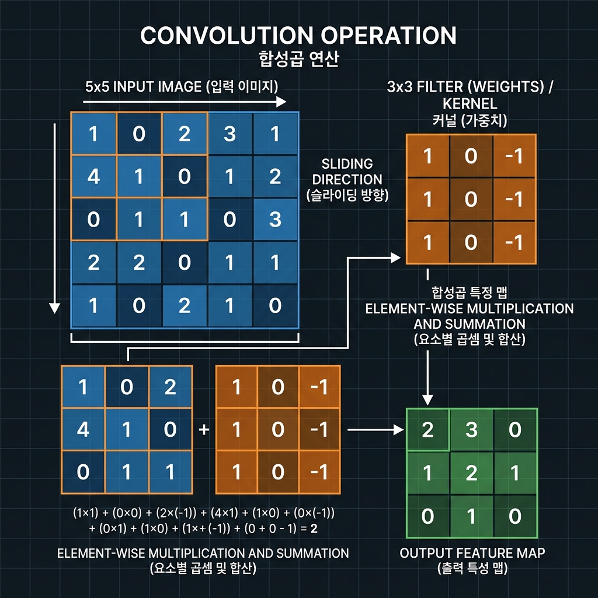
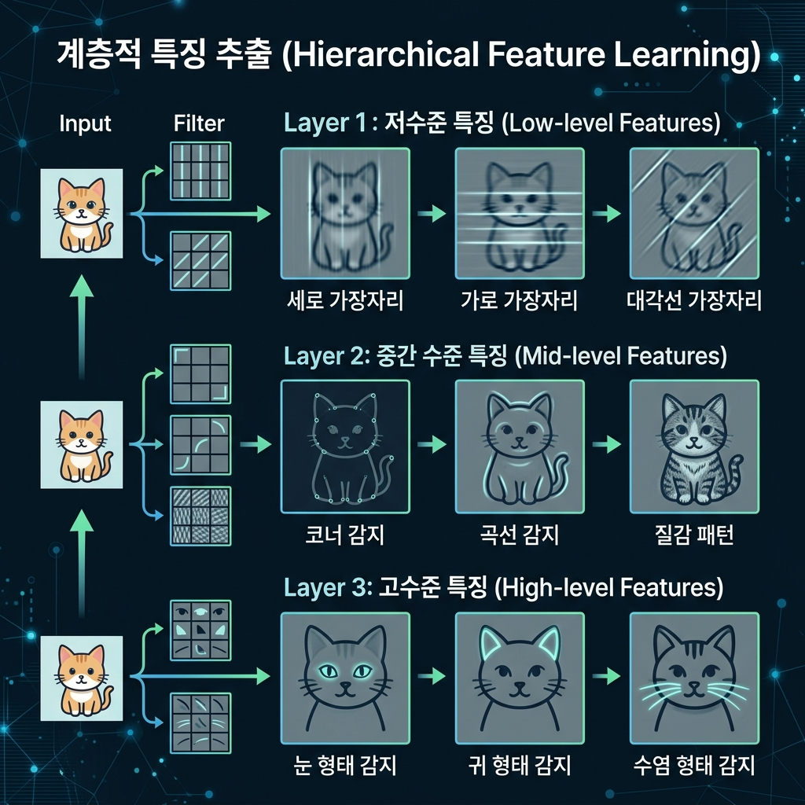
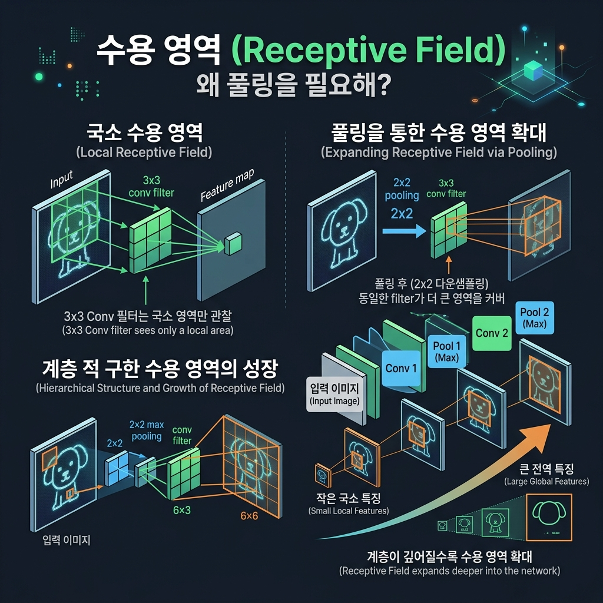
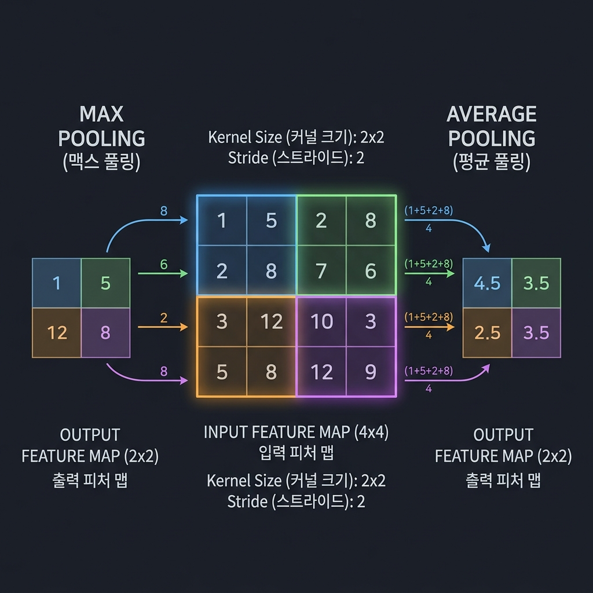
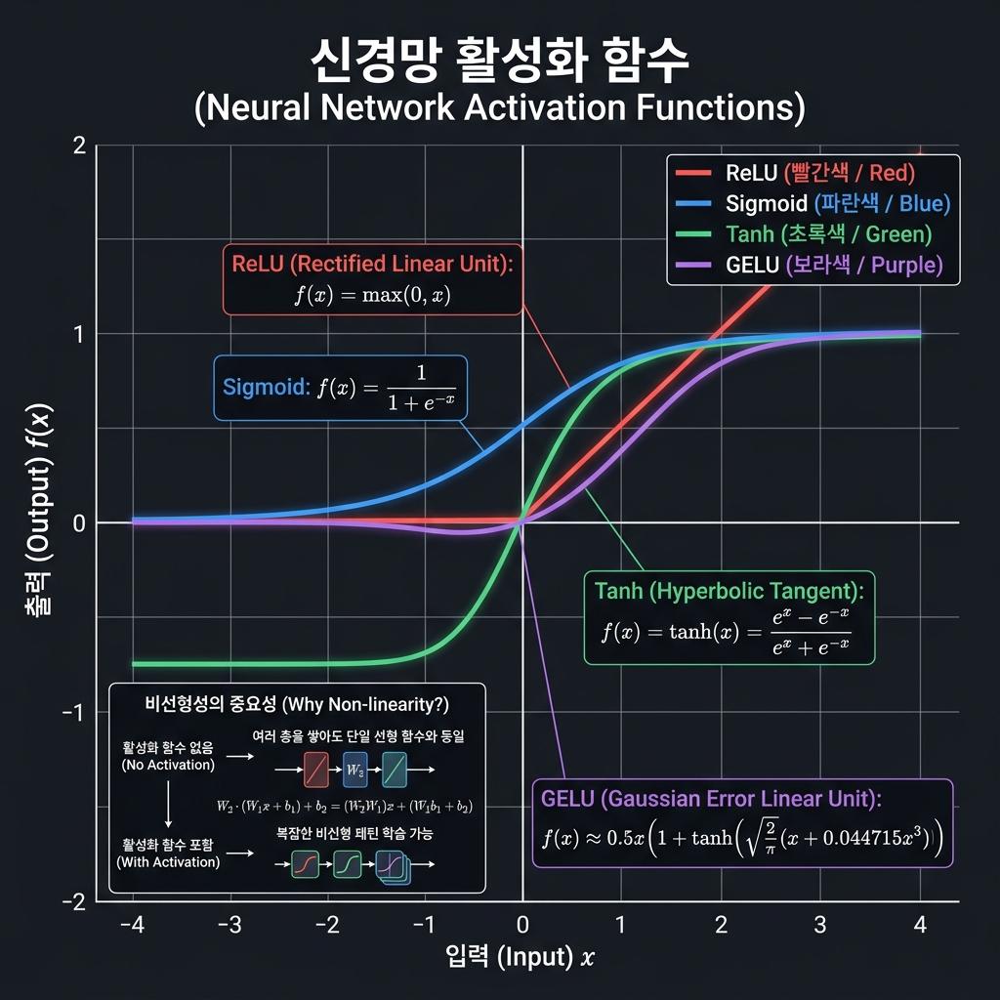

# 📘 Section 2. CNN 핵심 이론

> **학습 목표**
> - Convolution 연산의 역할과 동작 원리를 이해한다.
> - 학습을 통해 필터가 다양한 특징을 추출하게 되는 과정을 이해한다.
> - Pooling의 필요성과 Max/Average Pooling의 차이를 설명할 수 있다.
> - 활성화 함수(Activation Function)의 역할과 주요 함수를 구분할 수 있다.

---

## 2-1. Convolution (합성곱) 연산

### 🎯 Convolution의 역할

CNN(Convolutional Neural Network)의 핵심인 **합성곱(Convolution) 연산**은 이미지에서 **공간적 특징을 추출**하는 역할을 합니다.

- **엣지(Edge)**: 밝기가 급변하는 경계선
- **텍스처(Texture)**: 반복되는 패턴 (줄무늬, 점무늬 등)
- **형태(Shape)**: 곡선, 윤곽, 모서리
- **색상 패턴**: 특정 색의 분포

> 💡 핵심: Convolution은 **"이 이미지의 이 영역에 어떤 특징이 있는가?"** 를 감지하는 연산입니다.

---

### ⚙️ Convolution 연산은 어떻게 동작할까?



Convolution 연산의 구성 요소는 다음과 같습니다.

| 구성 요소 | 설명 |
|-----------|------|
| **입력 (Input)** | 이미지 또는 이전 층의 특징 맵 (Feature Map) |
| **필터/커널 (Filter/Kernel)** | 작은 크기의 가중치 행렬 (예: 3×3, 5×5) |
| **출력 (Output)** | 특징 맵 (Feature Map) — 해당 특징이 어디에 얼마나 강하게 있는지 |

#### 📝 연산 과정 (Step-by-Step)

```
[Step 1] 필터를 입력 이미지의 왼쪽 상단에 올려놓습니다.

[Step 2] 필터와 겹치는 영역의 픽셀 값과 필터 가중치를
         "원소별 곱셈(element-wise multiplication)" 합니다.

[Step 3] 곱셈 결과를 모두 더하고, 편향(bias)을 더합니다.
         → 이 값이 출력 특징 맵의 한 칸이 됩니다.

[Step 4] 필터를 한 칸 옆으로 이동(slide)하고, Step 2~3을 반복합니다.

[Step 5] 끝까지 이동하면 한 행 아래로 내려가서 다시 반복합니다.
         → 전체 이미지를 훑으면 하나의 특징 맵(Feature Map)이 완성됩니다.
```

#### 🔢 구체적인 계산 예시

```
입력 이미지 (5×5)             필터 (3×3)
┌───┬───┬───┬───┬───┐       ┌────┬────┬────┐
│ 1 │ 0 │ 1 │ 2 │ 1 │       │  1 │  0 │ -1 │
├───┼───┼───┼───┼───┤       ├────┼────┼────┤
│ 0 │ 1 │ 2 │ 1 │ 0 │       │  1 │  0 │ -1 │
├───┼───┼───┼───┼───┤       ├────┼────┼────┤
│ 1 │ 2 │ 1 │ 0 │ 1 │       │  1 │  0 │ -1 │
├───┼───┼───┼───┼───┤       └────┴────┴────┘
│ 0 │ 1 │ 0 │ 2 │ 1 │
├───┼───┼───┼───┼───┤
│ 1 │ 0 │ 1 │ 1 │ 0 │       첫 번째 위치의 계산:
└───┴───┴───┴───┴───┘

    (1×1) + (0×0) + (1×-1)       =  0
  + (0×1) + (1×0) + (2×-1)       = -2
  + (1×1) + (2×0) + (1×-1)       =  0
                            합계  = -2  + bias
```

이 과정을 **슬라이딩 윈도우(Sliding Window)** 방식으로 이미지 전체에 걸쳐 반복합니다.

> 🎬 **동적 시각화 참고 자료**
>
> 합성곱 연산의 슬라이딩 과정을 애니메이션으로 이해하면 더욱 직관적입니다.
> - 📎 [CNN Convolution 애니메이션 (vdumoulin/conv_arithmetic)](https://github.com/vdumoulin/conv_arithmetic) — 다양한 convolution 종류의 GIF 모음
> - 📎 [CNN Explainer (Interactive)](https://poloclub.github.io/cnn-explainer/) — 브라우저에서 직접 CNN 동작을 체험할 수 있는 인터랙티브 시각화

---

### 🔑 핵심 파라미터 (Hyperparameters)

| 파라미터 | 설명 | 일반적인 값 |
|----------|------|-------------|
| **커널 크기 (Kernel Size)** | 필터의 크기 | 3×3 (가장 흔함), 5×5, 7×7 |
| **필터 개수 (Number of Filters)** | 출력 채널 수 = 추출할 특징의 종류 수 | 16, 32, 64, 128 ... |
| **스트라이드 (Stride)** | 필터가 이동하는 간격 | 1 (한 칸씩), 2 (두 칸씩) |
| **패딩 (Padding)** | 입력 주변에 값을 채워 출력 크기 유지 | 'same' (크기 유지), 'valid' (패딩 없음) |

```
💡 필터 개수가 중요한 이유:

   필터 1개 = 특징 1종류 추출 (예: 수직 엣지)
   필터 32개 = 특징 32종류 추출 (수직, 수평, 대각선, 곡선 등 다양한 패턴)

   → 필터 개수가 곧 출력 채널(Channel) 수가 됩니다.
   → 입력: H × W × C_in  →  출력: H × W × C_out (C_out = 필터 개수)
```

---

### 🧠 학습을 통한 필터의 진화

CNN의 가장 강력한 점은, **필터의 가중치(Weight)와 편향(Bias)이 학습 과정에서 자동으로 업데이트**된다는 것입니다.



#### 학습 전 vs 학습 후

```
학습 전 (초기화 직후):
┌──────────────────────────────────────┐
│  모든 필터가 랜덤한 값               │
│  → 의미 없는 패턴을 감지             │
└──────────────────────────────────────┘

        ⬇️  학습 (Training) 반복  ⬇️

학습 후 (수렴한 상태):
┌──────────────────────────────────────┐
│  필터 1: 수직 엣지를 감지  ┃         │
│  필터 2: 수평 엣지를 감지  ━         │
│  필터 3: 대각선을 감지     ╲         │
│  필터 4: 곡선을 감지       ⌒         │
│  필터 5: 특정 텍스처를 감지 ░        │
│  ...각 필터가 고유한 특징 전문가      │
└──────────────────────────────────────┘
```

#### 📐 계층적 특징 추출 (Hierarchical Feature Extraction)

CNN이 여러 층으로 쌓이면, 각 층은 **서로 다른 수준의 특징**을 추출합니다.

```
입력 이미지 (손글씨 '7')
    │
    ▼
┌─────────────────────────────────────────────────────┐
│  [Conv Layer 1]  저수준 특징 (Low-level Features)    │
│  → 엣지, 선분, 색상 경계                             │
│  예: ─  │  ╲  ╱  ⌐  ⌐                               │
└─────────────────────┬───────────────────────────────┘
                      ▼
┌─────────────────────────────────────────────────────┐
│  [Conv Layer 2]  중간 특징 (Mid-level Features)      │
│  → 모서리, 곡선, 간단한 형태                          │
│  예: ∟  ∠  ⌒  ◜  ◝                                  │
└─────────────────────┬───────────────────────────────┘
                      ▼
┌─────────────────────────────────────────────────────┐
│  [Conv Layer 3]  고수준 특징 (High-level Features)   │
│  → 숫자의 전체적인 윤곽과 구조                        │
│  예: "위에 수평선 + 대각선으로 내려옴" = '7'           │
└─────────────────────────────────────────────────────┘
```

> 📌 **핵심 정리**: Convolution 필터의 가중치는 사람이 설계하는 것이 아니라, **학습 데이터를 통해 모델이 스스로 최적화**합니다.
> 각 필터는 학습을 거쳐 서로 다른 특징(엣지, 곡선, 텍스처 등)을 감지하는 전문가가 되며,
> 층이 깊어질수록 단순한 특징에서 복잡한 특징으로 조합되어 갑니다.

---

## 2-2. Pooling (풀링)

### 🤔 왜 Pooling이 필요할까?

앞서 Convolution이 이미지의 **지역적(Local) 특징**을 추출한다고 배웠습니다.
일반적으로 3×3 크기의 필터를 사용하면, 한 번에 **3×3 = 9개 픽셀 범위**만 볼 수 있습니다.

하지만 이미지를 제대로 이해하려면 **더 넓은 영역의 특징**도 파악해야 합니다.

```
문제: "더 넓은 영역을 보려면 어떻게 해야 할까?"

방법 1: 필터 크기를 키운다? (3×3 → 7×7 → 15×15 ...)
  → ❌ 파라미터 수가 급격히 증가 (3×3=9개 → 7×7=49개 → 15×15=225개)
  → ❌ 연산량 폭증, 과적합(overfitting) 위험 증가

방법 2: 특징 맵의 크기를 줄인다? ✅ → 이것이 Pooling!
  → 같은 3×3 필터라도 축소된 특징 맵에서는 원본의 더 넓은 영역에 해당
  → 파라미터 수 변화 없음! 연산 효율적!
```



#### 📐 수용 영역 (Receptive Field) 의 확장

**수용 영역(Receptive Field)** 이란, 하나의 출력 뉴런이 원본 이미지에서 "실질적으로 바라보는 영역"의 크기입니다.

```
[Pooling 없이 Conv만 2개 쌓은 경우]

Conv1 (3×3) → Conv2 (3×3)
수용 영역: 5×5 (느리게 증가)

[Conv + Pooling + Conv 인 경우]

Conv1 (3×3) → Pool (2×2) → Conv2 (3×3)
수용 영역: 10×10 (빠르게 확장!)
→ Pooling으로 특징 맵을 절반으로 줄였으므로,
  다음 Conv의 3×3은 원본 기준 훨씬 넓은 영역에 해당
```

> 💡 **비유**: 지도를 확대(zoom-in)해서 보면 작은 영역만 보이고, 축소(zoom-out)하면 넓은 영역을 한눈에 볼 수 있습니다.
> Pooling은 특징 맵을 **"축소"** 하여 다음 Convolution이 더 넓은 맥락을 보게 해주는 역할입니다.

---

### 📏 Pooling 연산 방식

Pooling은 특징 맵을 일정 영역(보통 2×2)으로 나눈 뒤, 각 영역을 **하나의 대표 값으로 요약**합니다.



---

#### 🔴 Max Pooling (최대 풀링)

각 영역에서 **가장 큰 값(최댓값)** 을 선택합니다.

```
입력 (4×4)                    출력 (2×2)
┌────┬────┬────┬────┐
│  1 │  3 ┃  2 │  1 │         ┌────┬────┐
│  2 │  4 ┃  1 │  3 │    →    │  4 │  3 │   ← 각 영역의 최대값
┣━━━━┿━━━━╋━━━━┿━━━━┫         ├────┼────┤
│  1 │  0 ┃  5 │  2 │    →    │  3 │  5 │
│  3 │  1 ┃  2 │  4 │         └────┴────┘
└────┴────┴────┴────┘
  (2×2 영역)   (2×2 영역)      커널=2×2, 스트라이드=2
```

**특징:**
- 해당 영역에서 **가장 강한 특징(활성화)** 을 보존
- 약한 반응은 버림 → 노이즈에 강함
- **CNN에서 가장 널리 사용**

---

#### 🔵 Average Pooling (평균 풀링)

각 영역의 **평균값**을 계산합니다.

```
입력 (4×4)                    출력 (2×2)
┌────┬────┬────┬────┐
│  1 │  3 ┃  2 │  1 │         ┌──────┬──────┐
│  2 │  4 ┃  1 │  3 │    →    │ 2.50 │ 1.75 │  ← 각 영역의 평균
┣━━━━┿━━━━╋━━━━┿━━━━┫         ├──────┼──────┤
│  1 │  0 ┃  5 │  2 │    →    │ 1.25 │ 3.25 │
│  3 │  1 ┃  2 │  4 │         └──────┴──────┘
└────┴────┴────┴────┘
  (1+3+2+4)/4=2.50            커널=2×2, 스트라이드=2
```

**특징:**
- 영역 전체의 정보를 **고르게 반영**
- 부드러운 특징 맵 생성
- 주로 **네트워크 마지막 부분**에서 사용 (Global Average Pooling)

---

### 📊 Max Pooling vs Average Pooling 비교

| 비교 항목 | Max Pooling | Average Pooling |
|-----------|-------------|-----------------|
| **대표값 선택** | 영역 내 최대값 | 영역 내 평균값 |
| **특징 보존** | 가장 강한 특징만 보존 | 전체 특징을 평균적으로 반영 |
| **노이즈 민감도** | 노이즈에 강함 (약한 값 무시) | 노이즈에 다소 민감 (평균에 포함) |
| **정보 손실** | 최대값 외 정보 손실 | 상대적으로 적은 정보 손실 |
| **주요 사용처** | 중간 층 (특징 추출 단계) | 마지막 층 (Global Average Pooling) |
| **실전 선호도** | ⭐ 가장 많이 사용 | 특수 목적에 사용 |

> 📌 **실무 가이드**:
> - **중간 층**: Max Pooling이 일반적 (강한 특징을 살리고 약한 노이즈를 제거)
> - **마지막 층**: Global Average Pooling (GAP)이 트렌드
>   - 전체 특징 맵을 채널별로 하나의 값으로 요약
>   - Fully Connected Layer의 파라미터 수를 대폭 줄여줌

---

### 🔄 Pooling의 효과 정리

```
입력 이미지: 28 × 28 × 1 (MNIST)

Conv1 (3×3, 필터 16개, padding='same')  →  28 × 28 × 16
MaxPool (2×2)                           →  14 × 14 × 16  ← 가로·세로 절반!

Conv2 (3×3, 필터 32개, padding='same')  →  14 × 14 × 32
MaxPool (2×2)                           →   7 ×  7 × 32  ← 또 절반!

💡 공간 크기(H×W)는 점점 줄어들고,
   채널 수(C)는 점점 늘어나는 것이 CNN의 전형적인 패턴입니다.

   → 공간 정보 압축 + 특징 다양성 확대
```

---

## 2-3. 활성화 함수 (Activation Function)

### 🤔 왜 활성화 함수가 필요할까?

Convolution 연산은 본질적으로 **선형 연산(Linear Operation)** 입니다.

```
출력 = 입력 × 가중치 + 편향  (y = Wx + b)
```

선형 연산만으로 아무리 많은 층을 쌓아도, 수학적으로는 **단 하나의 선형 변환과 동일**합니다.

```
Layer 1:  y₁ = W₁x + b₁
Layer 2:  y₂ = W₂y₁ + b₂ = W₂(W₁x + b₁) + b₂ = (W₂W₁)x + (W₂b₁ + b₂)
                                                   ^^^^^^^^    ^^^^^^^^^^^^
                                                   하나의 W'    하나의 b'

→ 결국  y = W'x + b'  와 동일! (층을 쌓은 의미가 없음)
```

**활성화 함수는 이 선형 연산 사이에 "비선형성(Non-linearity)"을 주입**하여,
네트워크가 복잡한 패턴(곡선, 경계, 조합)을 학습할 수 있게 합니다.

```
[활성화 함수 없이 (선형만)]         [활성화 함수 포함 (비선형)]

  직선으로만 분류 가능                곡선, 복잡한 경계로 분류 가능

       ·  ·  ·                           ·  ·  ·
    ──────────── (직선)                ·  ╭─────╮  ·
       ○  ○  ○                        ○  │  ·  │  ○
                                      ○  ╰─────╯  ○
                                         ○  ○
```

> 💡 **비유**: 레고 블록이 직선 블록만 있으면 직선 구조물만 만들 수 있지만,
> 곡선 블록(비선형)을 추가하면 훨씬 다양하고 복잡한 구조물을 만들 수 있는 것과 같습니다.

---

### 📈 주요 활성화 함수



---

#### 1️⃣ ReLU (Rectified Linear Unit)

```
f(x) = max(0, x)

→ 양수는 그대로 통과, 음수는 0으로 처리
```

```
입력:  [-2, -1, 0, 1, 3, 5]
출력:  [ 0,  0, 0, 1, 3, 5]
        ^^^^^^^^
        음수는 모두 0
```

| 항목 | 내용 |
|------|------|
| **장점** | 계산이 매우 빠름 (비교 연산만 필요), 기울기 소실 문제 완화, 희소 활성화(sparse activation) |
| **단점** | **Dying ReLU 문제** — 음수 영역의 기울기가 0이라 한 번 비활성화되면 영원히 죽을 수 있음 |
| **사용처** | CNN 중간 층에서 **가장 많이 사용** ⭐ (오늘 실습에서도 사용!) |

---

#### 2️⃣ Sigmoid (시그모이드)

```
f(x) = 1 / (1 + e^(-x))

→ 출력 범위: 0 ~ 1 (확률로 해석 가능)
```

```
입력:  [-5,  -1,    0,    1,   5]
출력:  [0.007, 0.27, 0.50, 0.73, 0.993]
```

| 항목 | 내용 |
|------|------|
| **장점** | 출력이 0~1로 확률 해석 가능 |
| **단점** | **기울기 소실(Vanishing Gradient)** — 양 끝에서 기울기가 거의 0, 학습이 매우 느려짐 |
| **사용처** | 이진 분류의 **마지막 출력층**, 게이트 메커니즘 (LSTM 등) |

---

#### 3️⃣ Tanh (하이퍼볼릭 탄젠트)

```
f(x) = (e^x - e^(-x)) / (e^x + e^(-x))

→ 출력 범위: -1 ~ 1 (0 중심)
```

```
입력:  [-5,   -1,     0,    1,    5]
출력:  [-0.999, -0.76, 0.00, 0.76, 0.999]
```

| 항목 | 내용 |
|------|------|
| **장점** | 출력이 **0을 중심**으로 분포 → Sigmoid보다 학습 안정적 |
| **단점** | 여전히 **기울기 소실** 문제 존재 (양 끝에서 기울기 → 0) |
| **사용처** | RNN/LSTM 내부, 출력 값을 -1~1로 제한하고 싶을 때 |

---

#### 4️⃣ GELU (Gaussian Error Linear Unit)

```
f(x) = x × Φ(x)     (Φ는 표준정규분포의 누적분포함수)
≈ 0.5x(1 + tanh[√(2/π)(x + 0.044715x³)])

→ ReLU와 비슷하지만, 0 근처에서 부드럽게 전환
```

| 항목 | 내용 |
|------|------|
| **장점** | 부드러운 곡선, 음수 입력도 약간의 값을 통과시킴, 최근 모델에서 뛰어난 성능 |
| **단점** | ReLU보다 계산 비용이 약간 높음 |
| **사용처** | **Transformer 계열 모델의 표준** (BERT, GPT, ViT 등) ⭐ |

---

### 📊 활성화 함수 비교 정리

| 함수 | 출력 범위 | 계산 속도 | 기울기 소실 | 주요 사용처 |
|------|-----------|-----------|-------------|-------------|
| **ReLU** | [0, ∞) | ⚡ 매우 빠름 | △ (양수에서 해결) | CNN 중간 층 ⭐ |
| **Sigmoid** | (0, 1) | 보통 | ✗ 심각 | 이진 분류 출력층 |
| **Tanh** | (-1, 1) | 보통 | ✗ 존재 | RNN/LSTM |
| **GELU** | (-0.17, ∞) | 약간 느림 | △ (양수에서 해결) | Transformer ⭐ |

> 🎯 **오늘 실습에서는?**
>
> 우리가 만들 MNIST CNN 모델에서는 **ReLU**를 사용합니다.
> - 계산이 빠르고 구현이 간단
> - CNN에서 검증된 성능
> - 초보자가 이해하기 쉬운 직관적인 동작

---

### 🔗 CNN에서의 연산 흐름 정리

지금까지 배운 3가지 핵심 연산이 CNN에서 어떤 순서로 동작하는지 정리합니다.

```
입력 이미지 (28×28×1)
       │
       ▼
 ┌─────────────┐
 │ Convolution  │  특징 추출 (엣지, 텍스처, 형태)
 │   3×3, 16   │  → 28×28×16
 └──────┬──────┘
        ▼
 ┌─────────────┐
 │  Activation  │  비선형성 부여 (ReLU)
 │    (ReLU)    │  → 28×28×16 (음수 → 0)
 └──────┬──────┘
        ▼
 ┌─────────────┐
 │  Max Pool    │  공간 압축, 수용 영역 확대
 │   2×2       │  → 14×14×16
 └──────┬──────┘
        ▼
    ┌───────┐
    │ 반복! │  → Conv → ReLU → Pool → ...
    └───┬───┘
        ▼
 ┌─────────────┐
 │   Flatten    │  2D 특징 맵을 1D 벡터로 변환
 │             │  → (7×7×32 = 1568,)
 └──────┬──────┘
        ▼
 ┌─────────────┐
 │ Fully        │  특징 벡터를 클래스별 점수로 변환
 │ Connected    │  → (10,)  ← 0~9 숫자 10개 클래스
 └──────┬──────┘
        ▼
   예측 결과: "7" (95.3%)
```

> 📌 **핵심 공식**:
> ```
> CNN의 기본 블록 = Convolution → Activation → Pooling
> ```
> 이 블록을 반복 적용하여 이미지에서 점점 더 추상적이고 의미 있는 특징을 추출하고,
> 최종적으로 Fully Connected Layer를 통해 분류 결과를 도출합니다.

---

> 📚 **참고 자료**
> - 📎 [CNN Explainer (Interactive)](https://poloclub.github.io/cnn-explainer/) — CNN 동작을 브라우저에서 직접 체험
> - 📎 [Convolution Animations (GitHub)](https://github.com/vdumoulin/conv_arithmetic) — Convolution 연산 GIF 모음
> - 📎 [Zeiler & Fergus (2013)](https://arxiv.org/abs/1311.1901) — CNN이 학습한 필터를 시각화한 논문
> - 📎 [CS231n: CNN for Visual Recognition](https://cs231n.github.io/convolutional-networks/) — Stanford CNN 강의 자료
