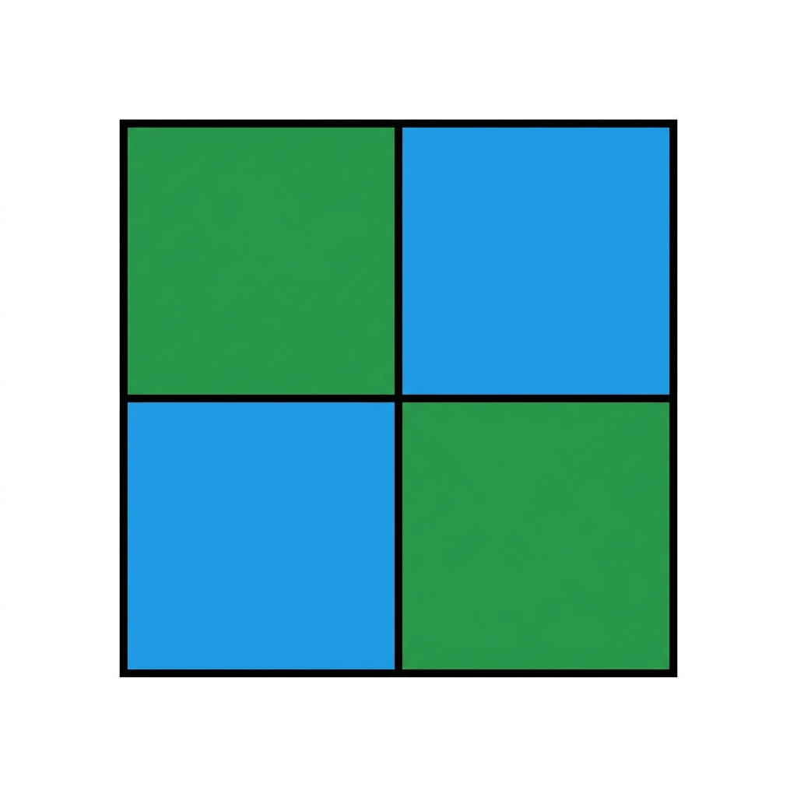
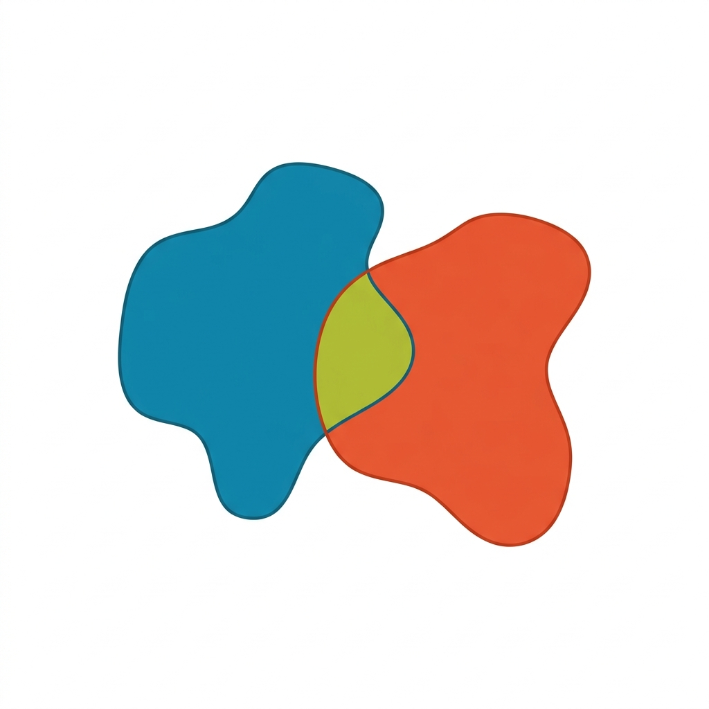
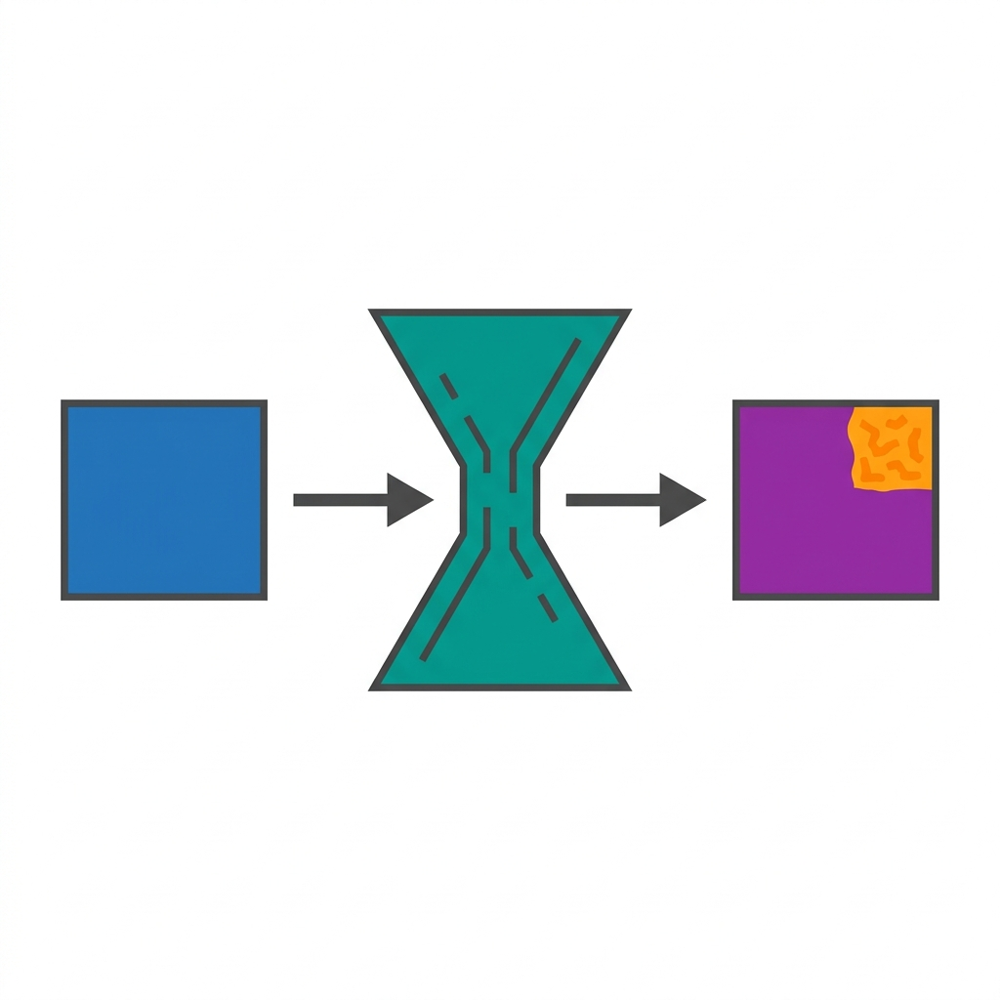

# 📘 Section 1. Vision AI Task별 주요 Loss와 Metric 이론

> **학습 목표**
> - 모델을 학습시키고 평가하는 기준이 되는 **Loss(손실 함수)**와 **Metric(평가지표)**의 개념을 이해한다.
> - Vision AI의 4가지 주요 Task(분류, 객체탐지, 분할, 이상탐지)별로 사용되는 핵심 Loss와 Metric을 매칭할 수 있다.

---

## 🤔 Loss와 Metric이란?

모델을 학습시키고 그 성능을 평가하기 위해서는 두 가지 핵심적인 지표가 필요합니다.

| 구분 | 목적 | 특징 | 사용 시점 |
|------|------|------|-----------|
| **Loss (손실 함수)** | 모델이 정답과 얼마나 틀렸는지를 계산하여 **모델을 업데이트(학습)**하는 데 사용 | 미분 가능해야 함 (기울기를 구해야 하므로) | 모델 **학습(Training)** 중 |
| **Metric (평가지표)** | 사람이 모델의 성능을 직관적으로 **평가하고 비교**하기 위해 사용 | 미분 불가능해도 됨 (단순 퍼센트 등) | 모델 **평가(Validation/Test)** 중 |

---

## 1️⃣ 분류 (Classification)

이미지가 어떤 클래스에 속하는지 하나의 정답을 맞추는 Task입니다.

### 📉 주요 Loss: Cross-Entropy Loss (교차 엔트로피 손실)
모델이 예측한 **클래스별 확률 분포**와 **실제 정답(One-hot 형태)** 간의 차이를 계산합니다.
- 정답 클래스에 대해 모델이 100%(1.0)의 확신을 가질수록 Loss는 0에 가까워집니다.
- **Binary Cross-Entropy (BCE)**: 두 개의 클래스(개/고양이)를 분류할 때 사용합니다.
- **Categorical Cross-Entropy (CCE)**: 세 개 이상의 다중 클래스(숫자 0~9)를 분류할 때 사용합니다. (이번 실습에서 사용할 Loss입니다!)

#### 📝 수식

**Binary Cross-Entropy (BCE)**

```
L = - [ y · log(p) + (1 - y) · log(1 - p) ]
```

| 기호 | 의미 |
|------|------|
| `y` | 실제 정답 (0 또는 1) |
| `p` | 모델이 예측한 확률 (0~1 사이) |

> 🔍 **수식 해석**
>
> - 정답이 `y=1`(양성)일 때: `L = -log(p)` → 모델이 높은 확률(p≈1)로 예측하면 Loss가 0에 가까워지고, 낮은 확률(p≈0)로 예측하면 Loss가 무한대로 커짐
> - 정답이 `y=0`(음성)일 때: `L = -log(1-p)` → 모델이 낮은 확률(p≈0)로 예측하면 Loss가 0에 가까워짐
> - 즉, **"정답에 대한 확신이 높을수록 페널티가 줄어드는"** 구조

**Categorical Cross-Entropy (CCE)** — 다중 클래스용

```
L = - Σ(c=1 ~ C) y_c · log(p_c)
```

| 기호 | 의미 |
|------|------|
| `C` | 전체 클래스 수 (예: MNIST는 10) |
| `y_c` | 클래스 c의 정답 (One-hot: 정답이면 1, 아니면 0) |
| `p_c` | 모델이 클래스 c라고 예측한 확률 (Softmax 출력) |

> 🔍 **수식 해석**
>
> - One-hot 인코딩 덕분에 정답 클래스(`y_c=1`)를 제외한 나머지 항은 모두 0이 됨
> - 결국 **`L = -log(p_정답)`** 으로 단순화됨: 정답 클래스의 예측 확률이 높을수록 Loss가 작아짐
> - 예: 정답이 "7"이고 모델이 p₇=0.95로 예측 → `L = -log(0.95) ≈ 0.05` (매우 낮은 Loss)
> - 예: 정답이 "7"인데 모델이 p₇=0.10로 예측 → `L = -log(0.10) ≈ 2.30` (높은 Loss → 큰 페널티)

### 📊 주요 Metric: Accuracy (정확도) 및 Confusion Matrix


*(그림: Confusion Matrix의 개념적 구조)*

- **Accuracy (정확도)**: 전체 예측 중 올바르게 예측한 비율입니다. 데이터의 클래스 비율이 균등할 때 매우 직관적입니다.

```
Accuracy = 올바르게 예측한 수 / 전체 데이터 수
```

- **Confusion Matrix (혼동 행렬)**: 모델이 어느 클래스를 어느 클래스로 헷갈려하는지 2D 표 형태로 보여줍니다. (예: 모델이 숫자 7을 1로 자주 착각함)

```
                     예측(Predicted)
                  Positive   Negative
실제   Positive [   TP    |    FN    ]
(Actual)
       Negative [   FP    |    TN    ]

TP = True Positive  (정답을 정답이라고 맞춤)
FN = False Negative (정답을 오답이라고 틀림)
FP = False Positive (오답을 정답이라고 틀림)
TN = True Negative  (오답을 오답이라고 맞춤)
```

- **Precision (정밀도) & Recall (재현율)**: 불균형한 데이터셋에서 정확도(Accuracy)의 한계를 보완하기 위해 사용됩니다.
  - 정밀도: 모델이 '정답'이라고 예측한 것 중 진짜 정답의 비율
  - 재현율: 실제 '정답' 중 모델이 찾아낸 비율

```
Precision = TP / (TP + FP)
Recall    = TP / (TP + FN)
```

- **F1-Score**: 정밀도와 재현율의 조화 평균으로, 두 지표가 모두 높을 때 높은 값을 가집니다.

```
F1 = 2 × (Precision × Recall) / (Precision + Recall)
```

---

## 2️⃣ 객체 탐지 (Object Detection)

이미지 안에서 여러 객체의 **위치(박스)**를 찾고, 그 객체의 **종류(클래스)**를 동시에 맞추는 Task입니다.

### 📉 주요 Loss: 위치 Loss + 분류 Loss
객체 탐지는 두 가지 문제를 동시에 풀어야 하므로, Loss도 두 가지를 더해서 사용합니다.
1. **Bounding Box Regression Loss (위치 손실)**: 모델이 예측한 박스의 위치/크기와 실제 정답 박스의 차이를 계산합니다.
   - 주로 **Smooth L1 Loss**나, 박스가 겹치는 정도를 고려한 **GIoU Loss**를 사용합니다.
2. **Classification Loss (분류 손실)**: 찾은 박스 안의 객체가 무엇인지 맞추는 Loss입니다.
   - 배경(배경에는 객체가 없음)이 압도적으로 많은 문제점을 해결하기 위해 **Focal Loss**를 자주 사용합니다.

#### 📝 수식

**Smooth L1 Loss (위치 손실)**

```
                 ┌  0.5 × x²      , |x| < 1
Smooth_L1(x) =  ┤
                 └  |x| - 0.5     , |x| ≥ 1

여기서 x = 예측 좌표 - 정답 좌표 (각 좌표별로 계산)
```

> 🔍 **수식 해석**
>
> - 오차(`x`)가 작을 때(|x|<1): L2(제곱)처럼 부드럽게 동작하여 안정적 학습
> - 오차가 클 때(|x|≥1): L1(절대값)처럼 동작하여 이상치(Outlier)에 덜 민감
> - 즉, **작은 오차에는 정밀하게, 큰 오차에는 안정적으로** 학습하는 하이브리드 방식

**GIoU Loss (Generalized IoU Loss)**

```
GIoU = IoU - (|C \ (A ∪ B)| / |C|)

L_GIoU = 1 - GIoU
```

| 기호 | 의미 |
|------|------|
| `A` | 예측 박스 영역 |
| `B` | 정답 박스 영역 |
| `C` | A와 B를 모두 포함하는 최소 사각형 영역 |
| `IoU` | A와 B의 교집합 / 합집합 |

> 🔍 **수식 해석**
>
> - 일반 IoU는 두 박스가 아예 겹치지 않으면 항상 0이라서, 얼마나 멀리 떨어져 있는지 알 수 없음
> - GIoU는 두 박스를 감싸는 최소 사각형(`C`) 내에서 비어있는 공간의 비율을 빼줌으로써, **겹치지 않는 경우에도 거리 정보를 반영**
> - 값의 범위: -1 ≤ GIoU ≤ 1 (완전히 겹치면 1, 멀수록 -1에 가까움)

**Focal Loss (분류 손실)**

```
FL(p_t) = -α_t × (1 - p_t)^γ × log(p_t)
```

| 기호 | 의미 |
|------|------|
| `p_t` | 정답 클래스에 대한 모델의 예측 확률 |
| `α_t` | 클래스별 가중치 (불균형 보정) |
| `γ` (감마) | 조절 계수 (보통 2), 쉬운 샘플의 기여를 줄이는 역할 |

> 🔍 **수식 해석**
>
> - Cross-Entropy에 `(1 - p_t)^γ` 가중 계수를 곱한 형태
> - 모델이 이미 잘 맞추는 **쉬운 샘플**(p_t가 높음) → `(1-p_t)^γ`이 매우 작아져 Loss 기여가 급감
> - 모델이 잘 못 맞추는 **어려운 샘플**(p_t가 낮음) → `(1-p_t)^γ`이 크게 유지되어 학습에 크게 반영
> - 객체 탐지에서 배경(쉬운 샘플)이 압도적으로 많은 불균형 문제를 효과적으로 해결

### 📊 주요 Metric: IoU와 mAP


*(그림: 두 박스가 겹치는 영역을 나타내는 IoU)*

- **IoU (Intersection over Union)**: 실제 정답 박스와 예측한 박스가 **얼마나 겹치는지**를 0~1 사이의 값으로 나타냅니다.
  - 교집합 영역을 합집합 영역으로 나눈 값입니다. 보통 IoU가 0.5 이상이면 "물체를 제대로 찾았다"고 간주합니다.

```
IoU = |A ∩ B| / |A ∪ B|

A: 예측 박스 영역,  B: 정답 박스 영역
```

- **mAP (mean Average Precision)**: 각 클래스별로 예측의 정확성(Precision)과 탐지율(Recall)을 종합하여 계산한 Average Precision(AP)의 평균값입니다. 객체 탐지의 가장 대표적인 종합 성능 지표입니다.

```
AP_c = ∫(0~1) Precision_c(r) dr     (클래스 c의 PR 곡선 아래 면적)

mAP  = (1/C) × Σ(c=1 ~ C) AP_c      (전체 클래스의 AP 평균)
```

---

## 3️⃣ 분할 (Segmentation)

이미지의 **모든 픽셀(Pixel)** 각각이 어떤 객체에 속하는지 칠해나가는 Task입니다.

### 📉 주요 Loss: Pixel-wise CE Loss와 Dice Loss
1. **Pixel-wise Cross-Entropy Loss**: 픽셀 단위로 적용하는 Cross-Entropy Loss입니다. 즉, "이 픽셀이 사람일 확률 vs 배경일 확률"을 계산합니다.
2. **Dice Loss**: 주로 의료 영상처럼 분할할 객체의 크기가 아주 작을 때(클래스 불균형) 사용됩니다. 예측 영역과 실제 영역이 겹치는 비율에 기반하여 최적화합니다.

#### 📝 수식

**Pixel-wise Cross-Entropy Loss**

```
L = - (1/N) × Σ(i=1 ~ N) Σ(c=1 ~ C) y_ic · log(p_ic)
```

| 기호 | 의미 |
|------|------|
| `N` | 전체 픽셀 수 (H × W) |
| `C` | 클래스 수 |
| `y_ic` | 픽셀 i의 클래스 c에 대한 정답 (0 또는 1) |
| `p_ic` | 픽셀 i가 클래스 c에 속할 모델의 예측 확률 |

> 🔍 **수식 해석**
>
> - 분류(Classification)의 Cross-Entropy를 **모든 픽셀에 대해 개별 적용한 뒤 평균**을 낸 것
> - 이미지의 각 픽셀이 하나의 독립적인 분류 문제가 되며, 모든 픽셀의 Loss 합산으로 전체 분할 품질을 최적화
> - 클래스 불균형이 심하면 (예: 배경 95%, 객체 5%) 배경 위주로 학습될 수 있어 Dice Loss와 함께 사용

**Dice Loss**

```
Dice = (2 × |P ∩ G|) / (|P| + |G|)

L_Dice = 1 - Dice
```

| 기호 | 의미 |
|------|------|
| `P` | 모델이 예측한 마스크 영역 (픽셀 집합) |
| `G` | 실제 정답(Ground Truth) 마스크 영역 |
| `P ∩ G` | 예측과 정답이 겹치는 영역 |

> 🔍 **수식 해석**
>
> - 분자 `2 × |P ∩ G|`: 겹치는 영역에 2를 곱함 (정밀도와 재현율의 조화 평균과 동일한 구조)
> - 분모 `|P| + |G|`: 예측 영역과 정답 영역의 전체 크기
> - 예측과 정답이 완벽히 일치하면 Dice = 1 → Loss = 0
> - 전혀 겹치지 않으면 Dice = 0 → Loss = 1
> - 클래스 불균형에 강함: 작은 객체라도 겹치는 비율 기반이므로 배경에 묻히지 않음

### 📊 주요 Metric: mIoU와 Dice Coefficient


*(그림: 실제 마스크와 예측 마스크의 겹침을 보여주는 분할 영역)*

- **mIoU (mean Intersection over Union)**: 객체 탐지에서의 IoU를 픽셀 단위 마스크 영역으로 확장한 것입니다. 정답 마스크 영역과 예측 마스크 영역이 겹치는 정도를 픽셀 수 기반으로 계산하여 클래스별 평균을 냅니다.

```
IoU_c = |P_c ∩ G_c| / |P_c ∪ G_c|     (클래스 c의 픽셀 단위 IoU)

mIoU  = (1/C) × Σ(c=1 ~ C) IoU_c      (전체 클래스의 IoU 평균)
```

- **Dice Coefficient**: 예측된 분할 영역과 정답 영역이 얼마나 일치하는지를 측정하는 지표로, F1-score와 수학적으로 동일합니다. 주로 0~1 사이의 값을 가집니다.

```
Dice = (2 × |P ∩ G|) / (|P| + |G|)
```

---

## 4️⃣ 이상 탐지 (Anomaly Detection)

정상 데이터만을 학습하여, 새로운 이미지가 들어왔을 때 기존에 보지 못한 패턴(비정상/결함)이 있는지 찾아내는 Task입니다.

### 📉 주요 Loss: Reconstruction Loss (복원 손실)
가장 대표적인 오토인코더(Autoencoder) 방식에서는 이미지를 압축했다가 다시 **똑같이 복원**하는 훈련을 합니다.
- **MSE (Mean Squared Error)** 또는 **MAE (Mean Absolute Error)**: 원본 이미지 픽셀 값과 모델이 복원한 이미지 픽셀 값의 차이를 줄이는 방향으로 학습합니다.
- 정상 데이터로만 훈련하면, 이상한 이미지가 들어왔을 때 모델이 복원을 제대로 못 하고 큰 Loss 값을 반환하게 됩니다.

#### 📝 수식

**MSE (Mean Squared Error)**

```
L_MSE = (1/N) × Σ(i=1 ~ N) (x_i - x̂_i)²
```

**MAE (Mean Absolute Error)**

```
L_MAE = (1/N) × Σ(i=1 ~ N) |x_i - x̂_i|
```

| 기호 | 의미 |
|------|------|
| `N` | 전체 픽셀 수 |
| `x_i` | 원본 이미지의 i번째 픽셀 값 |
| `x̂_i` | 모델이 복원한 이미지의 i번째 픽셀 값 |

> 🔍 **수식 해석**
>
> - 원본과 복원 결과의 **픽셀별 차이**를 계산하여 평균을 냄
> - MSE는 차이를 **제곱**하므로 큰 오차에 더 큰 페널티를 부여 → 뚜렷한 결함에 민감
> - MAE는 차이의 **절대값**을 사용하여 전체적으로 균등한 페널티 → 이상치에 덜 민감
> - **핵심 원리**: 정상 이미지만으로 학습하면, 학습 시 보지 못한 이상 영역은 복원이 부정확 → 해당 부위에서 Loss(오차)가 높게 나타남 → 이 오차 값 자체가 이상 점수(Anomaly Score)로 활용

### 📊 주요 Metric: AUROC


*(그림: 입력을 압축/복원하여 이상 부위의 복원 오차(Error)를 탐지하는 개념)*

- **AUROC (Area Under the ROC Curve)**: 정상과 비정상을 나누는 '기준점(Threshold)'이 변할 때마다의 성능을 종합적으로 보여주는 지표입니다. 이상 탐지 논문에서 가장 흔하게 쓰이는 표준 지표입니다. 1에 가까울수록 완벽한 모델입니다.

```
ROC 곡선: X축 = FPR (False Positive Rate),  Y축 = TPR (True Positive Rate)

FPR = FP / (FP + TN)    (정상인데 비정상이라고 잘못 판단한 비율)
TPR = TP / (TP + FN)    (비정상을 비정상이라고 정확히 판단한 비율)

AUROC = ROC 곡선 아래 면적  (0~1, 클수록 좋음)
```

- **F1-Score**: 제조업 결함 탐지처럼 불량이 매우 희귀한 경우, 불균형 데이터 평가에 유용한 F1-Score를 주요하게 보기도 합니다.

```
F1 = 2 × (Precision × Recall) / (Precision + Recall)
```

---

> 💡 **오늘 실습(Chapter 03)에서는?**
>
> 우리는 **이미지 분류(Classification)** Task를 실습합니다.
> 따라서 PyTorch에서 제공하는 `CrossEntropyLoss()`를 사용하여 모델을 학습시키고,
> 몇 개의 숫자를 맞췄는지 비율을 구하는 **Accuracy(정확도)**를 평가지표로 사용하게 될 것입니다!
